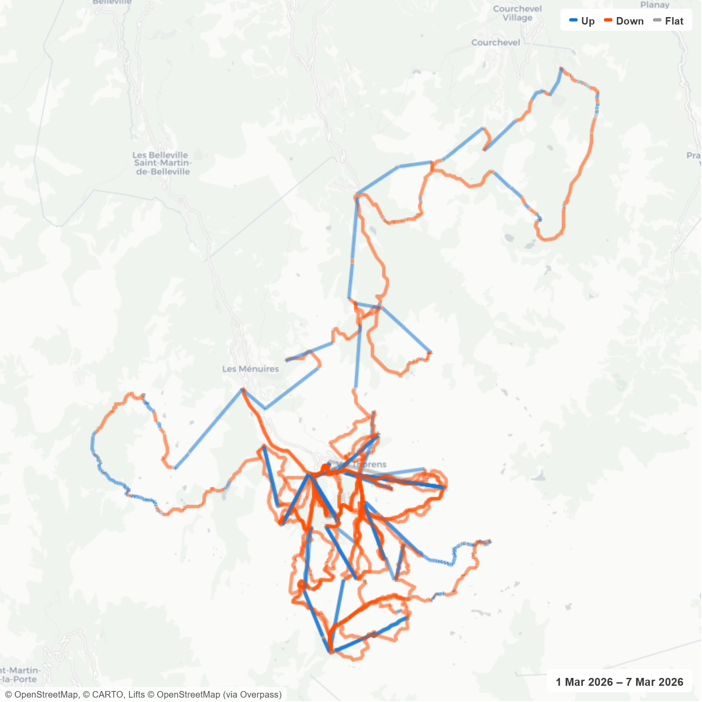

# strava-map

A small open-source web app that connects to Strava, lets you pick a sport and date range, and plots every activity onto **one composable Leaflet map** — with optional uphill/downhill colouring, ski-piste/lift overlays, auto-detected "trips", and one-click PNG export.

Built for things like *"show me my Jan ski trip on one map"* or *"how did my year of running look from above"*.


*(Above: a week of ski touring at Val Thorens — blue is uphill, orange is downhill, grey is flat. PNG generated by the app itself.)*

## Features

- **Strava OAuth** with persistent token refresh (localStorage)
- **Curated sport buckets** (Run / Ride / Ski+Snow / Hike+Walk / Swim / Water / Other) plus a dynamic per-`sport_type` chip filter
- **Date-range slicing** with cached activities so re-filtering is instant
- **Auto trip suggestions** — clusters activities by date proximity (>3-day gap breaks a cluster) and flags clusters whose centroid is >50 km from the user's median home location, with a max-150 km cluster diameter so unrelated locations don't get glued together
- **Heatmap-style polylines** in Strava orange, with low-opacity overlap that brightens frequently-trodden paths
- **Up/down direction colouring** — fetches Strava's altitude streams, smooths them, classifies segments by **grade** (rise/run) so ski touring at 3 km/h and alpine skiing at 50 km/h are scored on the same scale
- **Basemap toggle**: Light (CARTO) · Terrain (OpenTopoMap) · Satellite (Esri World Imagery)
- **Ski overlays**: OpenSnowMap pistes-and-lifts *or* a custom **lifts-only** layer that fetches `aerialway=*` ways from OpenStreetMap via the Overpass API (debounced refetch on pan/zoom, lift type colour-coded)
- **Six map shape presets** (Standard / Tall / Landscape 16:9 / Portrait 2:3 / Square / Banner) for composing exports
- **Fine zoom** (0.25-step) and stream-cached redraws
- **Date watermark** + tile attribution + 2× PNG export via `html2canvas`, with the +/- zoom control stripped from snapshots

## Tech stack

Vite 7 · React 19 · TypeScript 5.9 · Material-UI 7 · Leaflet · Jest · html2canvas

No backend. All API calls are direct from the browser to Strava / OpenSnowMap / Overpass / tile providers. Tokens and caches live in `localStorage`.

## Quick start

```bash
git clone https://github.com/mgjohnston/strava-map.git
cd strava-map
cp .env.example .env   # fill in your Strava client ID/secret
npm install
npm run dev
```

You'll need a Strava API application — create one at <https://www.strava.com/settings/api> and use `http://localhost:5173/` as the redirect URI.

```env
VITE_STRAVA_CLIENT_ID=
VITE_STRAVA_CLIENT_SECRET=
VITE_STRAVA_REDIRECT_URI=http://localhost:5173/
```

## Commands

```bash
npm run dev      # Vite dev server
npm run build    # tsc -b && vite build
npm run lint     # ESLint
npm run preview  # preview the production build
npm test         # Jest
```

## Architecture

```
src/
├── App.tsx                         # AppShell + StravaConnect + MapView
├── components/
│   ├── layout/AppShell.tsx         # MUI AppBar + Container chrome
│   ├── strava/StravaConnect.tsx    # Top-bar connect/sync/disconnect
│   ├── map/ActivityMap.tsx         # Leaflet map, multi-polyline, heatmap, overlays, PNG export
│   ├── trip/                       # SportPicker, DateRangePicker, TripSuggestions
│   └── MapView.tsx                 # Single-page main view, wires everything together
├── hooks/
│   ├── useStrava.ts                # OAuth + activity cache
│   └── useActivityStreams.ts       # Lazy altitude-stream fetcher with localStorage cache
├── services/
│   ├── stravaAuth.ts               # OAuth: authorise, exchange, refresh
│   ├── stravaApi.ts                # Paged date-range activity fetch
│   ├── stravaStreams.ts            # /activities/{id}/streams fetch + cache
│   └── overpass.ts                 # OpenStreetMap aerialway query for lifts-only overlay
├── utils/
│   ├── polyline.ts                 # Google polyline decoder
│   ├── sportBuckets.ts             # Curated sport bucket map
│   └── tripDetection.ts            # Date-gap + away-from-home cluster detection
└── types/strava.ts                 # Strava API types
```

## Rate limits

Strava enforces 100 requests / 15 min and 1 000 / day. The app:
- pages through `/athlete/activities` up to 20 pages per sync (≤ 2 000 activities per range)
- only fetches altitude streams when the **Up/down** toggle is on, and only for activities currently in view; results are cached forever in `localStorage['strava_streams_cache_v1']` so toggling is instant on subsequent visits

## Attribution

Tile providers and OSM-derived data are credited via Leaflet's attribution control (bottom-left of every map and every PNG export):
- **CARTO** Light basemap, © OpenStreetMap contributors
- **OpenTopoMap** Terrain basemap, © OpenStreetMap contributors (CC-BY-SA)
- **Esri World Imagery** for the Satellite basemap
- **OpenSnowMap** for the pistes-and-lifts overlay
- **OpenStreetMap via Overpass API** for the lifts-only overlay

## Licence

MIT.
