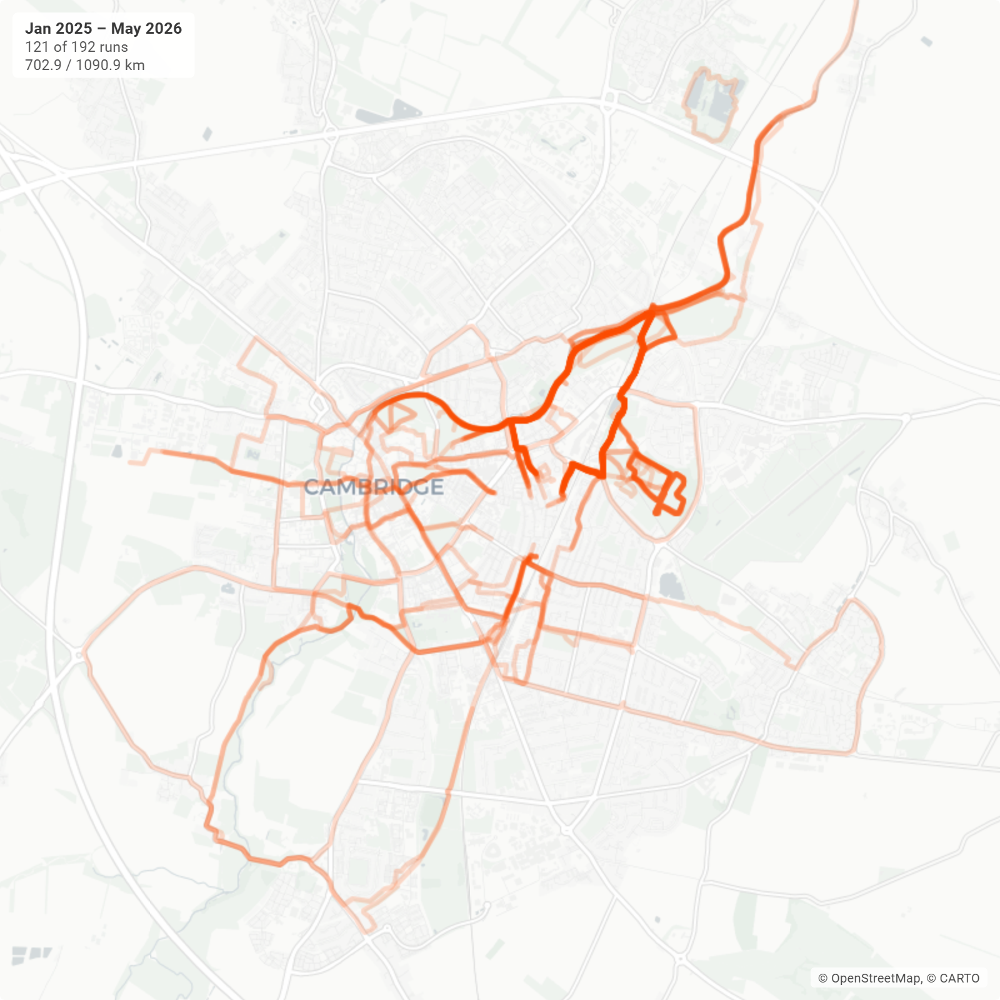

# Cambridge Runs

A focused fork of [`strava-map`](../README.md) for plotting **just runs** on a single Leaflet map across a chosen date range, with a per-run opacity control.

Built to visualise where you've actually been running most across a long streak — e.g. 70-week run streak in Cambridge.


*(Above: a 17-month window of Cambridge runs, exported as a square PNG. The bright overlap pattern reveals the river-and-Backs route, Coe Fen, the Hills Road–Addenbrooke's commute and the loops around Cherry Hinton — anywhere I've run repeatedly. Faint outliers show one-off out-of-town runs that the Cambridge-tight default keeps from dominating the frame.)*

## Features

- **Strava OAuth** with persistent token refresh (separate `cambridge_runs_*` localStorage keys, so it co-exists cleanly with the parent app)
- **Runs-only sync** — filters `sport_type ∈ {Run, TrailRun, VirtualRun}` at the API layer; non-run activities never enter the cache
- **Date range** with From / To pickers plus a **"Last N weeks" quick-set** (defaults to 70 — the streak that prompted this fork)
- **Heatmap-style polylines** in Strava orange — overlapping runs brighten the frequently-trodden paths
- **Global opacity slider** in the toolbar (0.05–1.0) to tune the heatmap density
- **Per-run opacity overrides** — expand the run list under the map to fade or boost any individual run; live updates via Leaflet `setStyle` so scrubbing the sliders is snappy even with 100+ runs
- **Cambridge-tight default view** — the map opens centred on `52.2053, 0.1218` at zoom 13 regardless of what's loaded, and only fits to route bounds when *all* routes sit within ~25 km of the city centre. Outlier runs (holidays, away trips) no longer zoom the heatmap out and shrink Cambridge to a dot
- **Live in-view stats overlay** (top-left of the map) — three lines: the month-year range, the visible / total run count, the visible / total distance. Updates on every pan/zoom (`moveend` recompute, point-by-point hit-test against the viewport)
- **Map shape presets**: Standard / Tall / Landscape 16:9 / Portrait 2:3 / **Square 1:1** / Banner — the square crop is the format the sample above was exported in
- **Basemap toggle**: Light (CARTO) · Terrain (OpenTopoMap) · Satellite (Esri World Imagery)
- **2× PNG export** via `html2canvas`, with the +/- zoom control stripped from snapshots
- **+/- zoom control parked bottom-left** so it doesn't sit on top of the stats overlay

## Setup

```bash
npm install
cp .env.example .env
# fill in VITE_STRAVA_CLIENT_ID and VITE_STRAVA_CLIENT_SECRET
npm run dev
```

You can reuse the same Strava API app credentials as the parent project (the redirect URI in `.env.example` is already `http://localhost:5173/`). Create one at <https://www.strava.com/settings/api>.

## Commands

```bash
npm run dev      # Vite dev server
npm run build    # tsc -b && vite build
npm run lint     # ESLint
npm test         # Jest (18 tests across polyline, OAuth, API)
```

## What's different from the parent app

This is a clone, not a feature branch, and it lives in its own subfolder with its own `package.json` / `node_modules`. The plumbing was carried across:

- `useStrava` + `stravaAuth` + `stravaApi` (with a `fetchRunsInDateRange` filter that drops non-runs)
- `decodePolyline` + Leaflet rendering + basemap toggle + shape selector + PNG export
- `AppShell` + `StravaConnect` chrome (rebranded to "Cambridge Runs")

Stripped out to keep it focused:

- Sport bucket picker and per-`sport_type` chip narrowing
- Auto-detected trip suggestions
- Ski piste / lift overlays
- Up/down altitude colouring and the stream-fetching plumbing
- Draggable title / subtitle overlays

Added for this fork:

- Global + per-run opacity controls
- "Last N weeks" quick-set with the 70-week streak as the default
- Cambridge-tight default view (centred at `[52.2053, 0.1218]`, zoom 13)
- Three-line in-view stats overlay (timeframe / `X of Y runs` / `X / Y km`)

## Licence

MIT.
